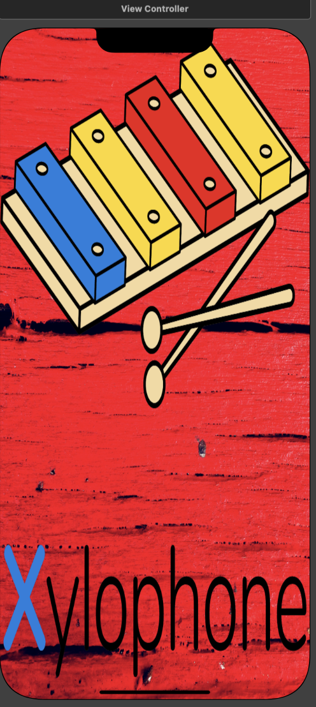

# Xylophone
Xylophone App to play sounds

Please unmute the video (controls given at bottom right of the video) before playing

https://user-images.githubusercontent.com/85452778/177502868-3eced08d-1b14-49d8-89c2-189ccc714108.mov

# UI Snapshots

# Techstack
  

# Resources

<a href="https://www.canva.com" target="_blank">Canva</a> &nbsp;&nbsp;&nbsp;&nbsp; <a href="https://colorhunt.co" target="_blank">Colorhunt</a> &nbsp;&nbsp;&nbsp;&nbsp; <a href="https://appicon.co" target="_blank">App Icon Generator</a>
